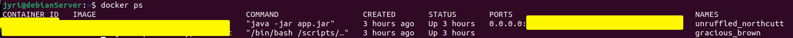
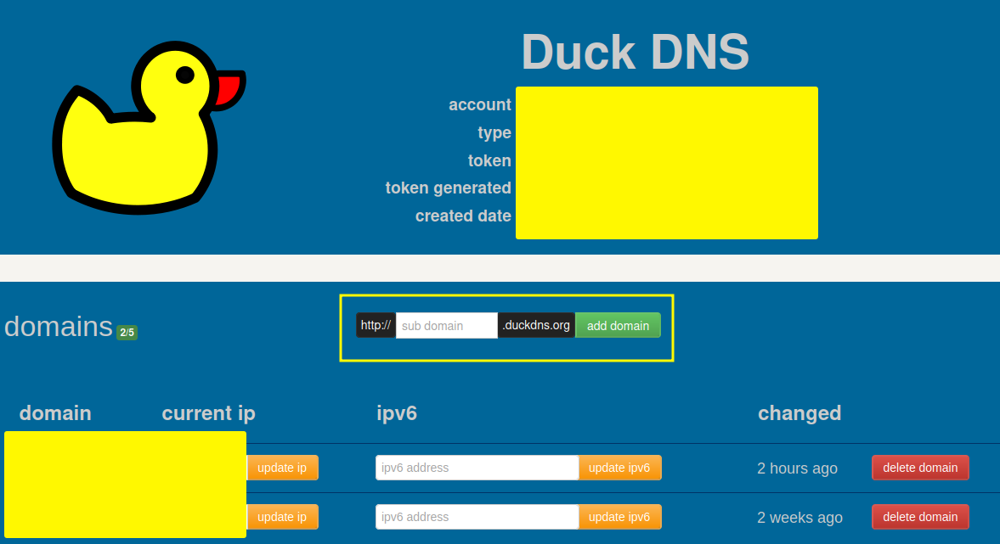

# Deploy Spring Boot Application in a docker container with apache and duckDNS


## Pre-Setup

Install docker according to Docker website. Debian for me:

https://docs.docker.com/engine/install/debian/

Install Apache:

```
sudo apt install apache2
```

## Creating Docker image and running it

Once Docker and Apache2 are installed, create a docker image from your spring boot application according to this youtube video:

https://www.youtube.com/watch?v=-9c6EeUbzgQ

OR

Create a file called Dockerfile with the following info in it:

```
FROM maven AS build

WORKDIR /app/dcpserver

COPY . .

RUN mvn clean package

FROM openjdk:17-slim

WORKDIR /app

COPY --from=build /app/dcpserver/target/DCP-Server*.jar app.jar

ENTRYPOINT ["java","-jar","app.jar"]
```

When the file is done, create a docker image: 

```
docker build -t *choose image name*
```

When the image is built, you can run it by:

```
docker run -p 8080:8080
```

You can decide whatever port you want, but 8080 is default one. You can change Spring boot app port from the application.properties file by adding the following text in it:

```
server.port=8081 OR whatever port you want
```

You need to build the docker image again, if you change the port after building the image. Remember that the docker image and Spring Boot both need to be configured for the same port.

Check if the Docker image is running:

```
docker ps
```



You should see a list of your docker images running.

## Get DuckDNS domain

Go to https://www.duckdns.org/ and login with gmail, or other login method.
Create a new domain name for your site. You can also use whatever domain you want, but DuckDNS is free and I use it for this demonstration. Create the domain (Inside yellow rectangle) 



Once it is created add the IP-address of your server and create click update ip. Now the domain directs the traffic to your server.

## Configuring Apache2

In order to use reverse Proxy, you need to enable it in apache.

```
sudo a2enmod proxy_http
```

You might need to restart the server after enabling proxy_http. 


Now it's time to create the configuration file for the Apache2. Create a new conf file:

```
sudo nano /etc/apache2/sites-available/*filename*.conf
```

You can give whatever name you want for the *filename*

inside the file write the following info:

```
<VirtualHost *:80>
    ServerName example.duckdns.org
    ProxyPass / http://127.0.0.1:8080/
    ProxyPassReverse / http://127.0.0.1:8080/
</VirtualHost>
```

Write the Domain name you just created to the ServerName section. Then to ProxyPass and ProxyPassReverse write the following but remember the Spring boot port (default 8080). Change it to the correct port if you have changed it. Then save the file.

Now enable the configuration file:

```
sudo a2ensite *filename*.conf
```

Again, remember what was the filename you used to create the configure file.

Then restart apache2:

```
sudo systemctl restart apache2.service 
```


## Enable port 8080 in firewall


You should have a ufw installed on your linux server. If it is not, install and enable it:

```
sudo apt install ufw
sudo ufw enable
```

Then open port 8080 (or whatever port you use):

```
sudo ufw allow 8080
```

That should be it. Try to open your domain with a browser and see if it works.
